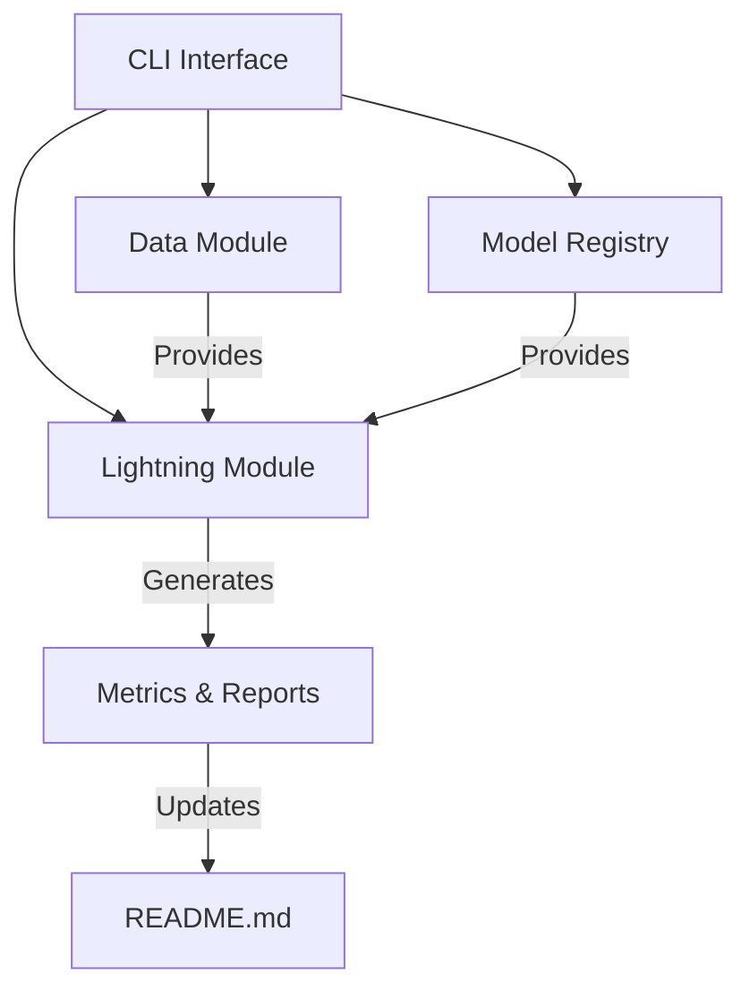

# LoveDA Benchmarking Project Architecture

## Overview
This document explains the project structure and component relationships. We use a modular architecture following PyTorch Lightning conventions.

## Key Components

### 1. Command Line Interface (cli.py)
- **Purpose**: Entry point for benchmark execution
- **Key Features**:
  - Argument parsing for model selection, data paths, and hyperparameters
  - Coordinates data loading, model initialization, and training workflow
  - Handles output generation and logging
- **Implementation Choices**:
  - Uses Click library for robust CLI handling
  - Separates configuration from core logic for flexibility

### 2. Data Module (data.py)
- **Responsibility**: LoveDA dataset handling
- **Key Functions**:
  - `load_data()`: TorchGeo dataset integration
  - `get_transform()`: Image preprocessing pipeline
  - `get_dataloader()`: Batch data loading
- **Design Notes**:
  - Custom transforms for satellite imagery
  - Automatic dataset validation checks

### 3. Model Registry (models.py)
- **Purpose**: Model initialization and configuration
- **Contents**:
  - Pretrained segmentation model definitions
  - Backbone selection logic
  - Custom head implementations
- **Supported Models**:
  - DeepLabV3
  - FCN-ResNet50
  - (Extensible to new architectures)

### 4. Lightning Module (lightning_module.py)
- **Core Logic**: Training/validation workflow
- **Key Aspects**:
  - Metric tracking (mIoU, accuracy, inference speed)
  - Memory usage monitoring
  - Checkpoint management
  - Automated README updates
- **Integration**:
  - Connects data loaders and models
  - Implements benchmark protocols

## Support Files

### setup.py
- **Purpose**: Package configuration
- **Handles**:
  - Dependency management
  - CLI command registration
  - Python package metadata

### .egg-info
- **Note**: Auto-generated package metadata (do not edit manually)
- **Contains**:
  - Installed files list
  - Dependency information
  - Entry points configuration

## Workflow Sequence
1. User runs CLI command with parameters
2. System loads data through TorchGeo integration
3. Initializes selected model architecture
4. Executes Lightning training/validation loop
5. Records metrics and updates documentation
6. Generates final benchmark report
