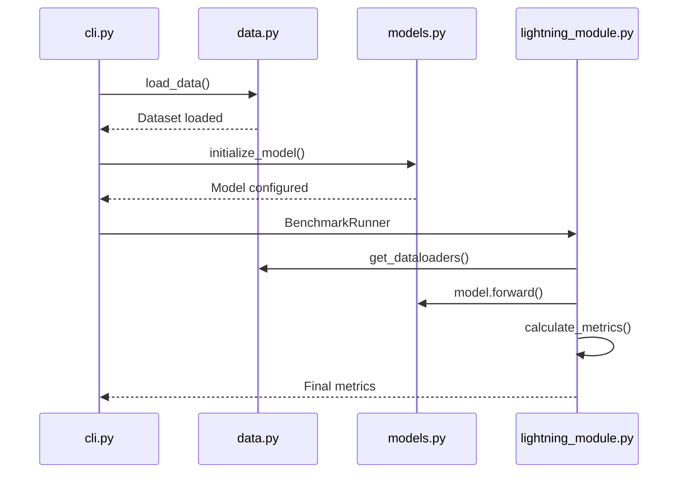
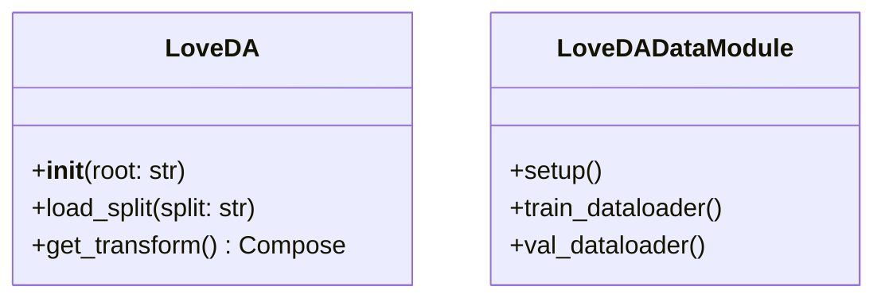

# LoveDA Benchmarking Technical Documentation

## Core Module Interactions


## File-Level Documentation

### 1. CLI Interface (cli.py)
**Purpose**: Main entry point for benchmark execution  
**Key Components**:
- `@click` decorators for command line arguments
- Model selection validation
- Output directory initialization
- Metric reporting hooks

**Example Flow**:
```python
@click.command()
@click.option('--models', multiple=True, required=True)
def main(models):
    # 1. Validate input models
    # 2. Initialize data loaders
    # 3. Run benchmark for each model
    # 4. Generate final report
```

### 2. Data Handling (data.py)
**Architecture**:


**Key Functions**:
- `normalize_sentinel2()`: Specialized normalization for satellite data
- `class_weights()`: Handles imbalanced class distributions
- `split_dataset()`: Maintains consistent train/val/test splits

### 3. Model Registry (models.py)
**Implementation Strategy**:
```python
def create_model(name: str) -> nn.Module:
    """Factory pattern for model initialization"""
    models = {
        "deeplabv3": DeepLabV3Wrapper,
        "fcn_resnet50": FCNResNetWrapper
    }
    return models[name]()
```

**Custom Components**:
- Head modification for 7-class output
- Pretrained weight loading
- Parameter freezing options

### 4. Lightning Module (lightning_module.py)
**Training Loop**:
1. Forward pass with mixed precision
2. Loss calculation (CrossEntropy + Dice)
3. Metric accumulation
4. Memory profiling
5. Checkpointing

**Validation Step**:
```python
def validation_step(self, batch, batch_idx):
    x, y = batch
    preds = self(x)
    loss = self.criterion(preds, y)
    self.log('val_loss', loss)
    self.metrics.update(preds.argmax(dim=1), y)
```

## Implementation Rationale

### Library Choices
- **PyTorch Lightning**: Enables scalable training & clean abstraction
- **TorchGeo**: Provides standardized satellite data handling
- **Click**: Robust CLI argument parsing with validation
- **TorchMetrics**: Consistent metric calculations

### Design Patterns
1. Factory Pattern (Model initialization)
2. Strategy Pattern (Different augmentation policies)
3. Observer Pattern (Metric tracking)
4. Facade Pattern (Simplified benchmark interface)

## FAQ: Common Implementation Questions

**Q: How to add new models?**  
1. Implement wrapper class in models.py
2. Register in model_factory dictionary
3. Update CLI validation list

**Q: Adjusting data transformations?**  
Modify `get_transform()` in data.py while maintaining:
- Input normalization
- Output tensor shapes
- Geometric transformation compatibility

**Q: Interpreting metrics?**  
- mIoU: Primary segmentation quality metric
- Memory: Peak GPU allocation
- Inference Time: FPS measured on validation set
