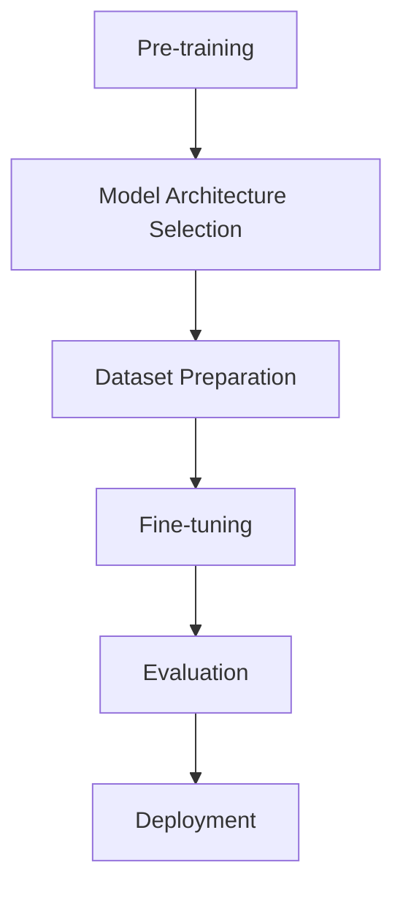
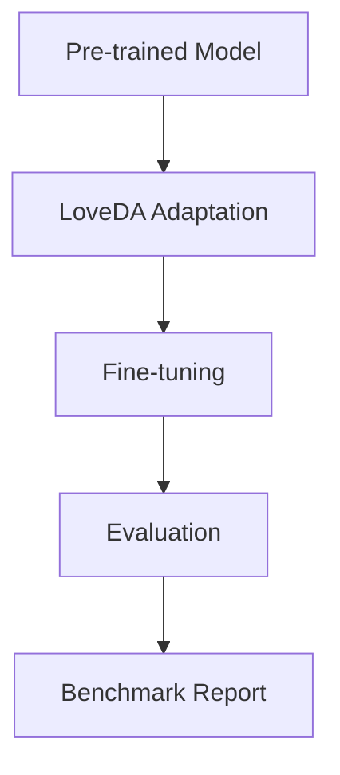

# Model Training Pipelines and Benchmarking Workflow

## Typical Model Training Pipeline

### 1. Pre-training
- Large-scale training on general datasets (e.g., ImageNet, COCO)
- Learns general feature representations
- Typically done once per architecture

### 2. Model Architecture Selection
- Choose appropriate architecture for task
- Consider computational requirements
- Select pre-trained weights

### 3. Dataset Preparation
- Data collection and annotation
- Preprocessing and augmentation
- Train/validation/test splits

### 4. Fine-tuning
- Adapt pre-trained model to specific task
- Modify final layers
- Train with task-specific loss function

### 5. Evaluation
- Quantitative metrics (mIoU, accuracy, etc.)
- Qualitative assessment
- Performance profiling

### 6. Deployment
- Model optimization
- Integration into production systems
- Monitoring and maintenance

## Current Benchmarking Workflow

Our benchmarking process focuses on the **Fine-tuning** and **Evaluation** stages:

Key characteristics:
- Starts with pre-trained models
- Modifies final layers for 7-class output
- Uses LoveDA-specific data augmentation
- Tracks both accuracy and efficiency metrics

## Example: DeepLabV3 Pipeline

### 1. Pre-training
- Trained on COCO dataset
- ResNet-50/101 backbone
- Large receptive field for context

### 2. LoveDA Adaptation
- Replace final classification layer
- Adjust for 7 output classes
- Initialize with COCO weights

### 3. Fine-tuning
- Train with combined loss:
  - CrossEntropy for class prediction
  - Dice for segmentation quality
- Mixed precision training
- Class-weighted sampling

### 4. Evaluation
- Metrics:
  - mIoU: 0.72
  - Inference speed: 15 FPS
  - Memory usage: 4.2 GB
- Visual assessment of predictions

## Current Benchmarking Position

Our workflow focuses on the **Fine-tuning** and **Evaluation** stages:
- Utilizes pre-trained models
- Adapts final layers for LoveDA
- Evaluates both accuracy and efficiency
- Generates comprehensive benchmark reports

This approach allows for:
- Faster iteration
- Reduced computational costs
- Direct comparison of model architectures
- Focus on task-specific performance
